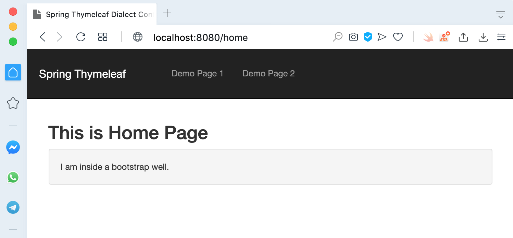
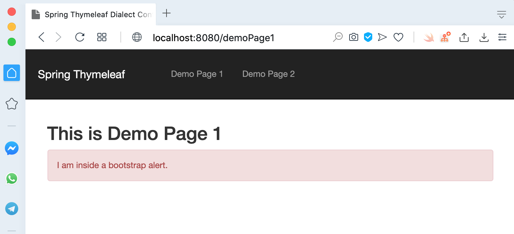
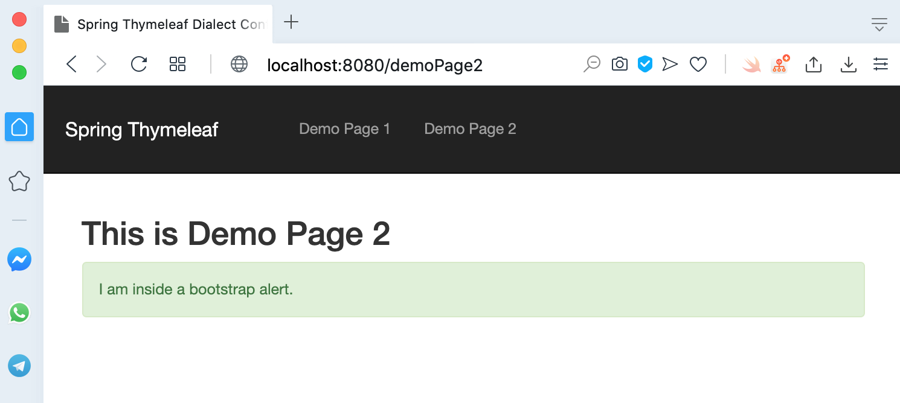

# springboot-thymeleaf-layout-dialect
## Things to do list:
1. Clone this repository: `git clone https://github.com/hendisantika/springboot-thymeleaf-layout-dialect.git`.
2. Go to the folder: `cd springboot-thymeleaf-layout-dialect`.
3. Run the application: `gradle clean bootRun --info`.
4. Open your favorite browser: http://localhost:8080/home

## Screen shot

Home Page

Demo Page1

Demo Page2

